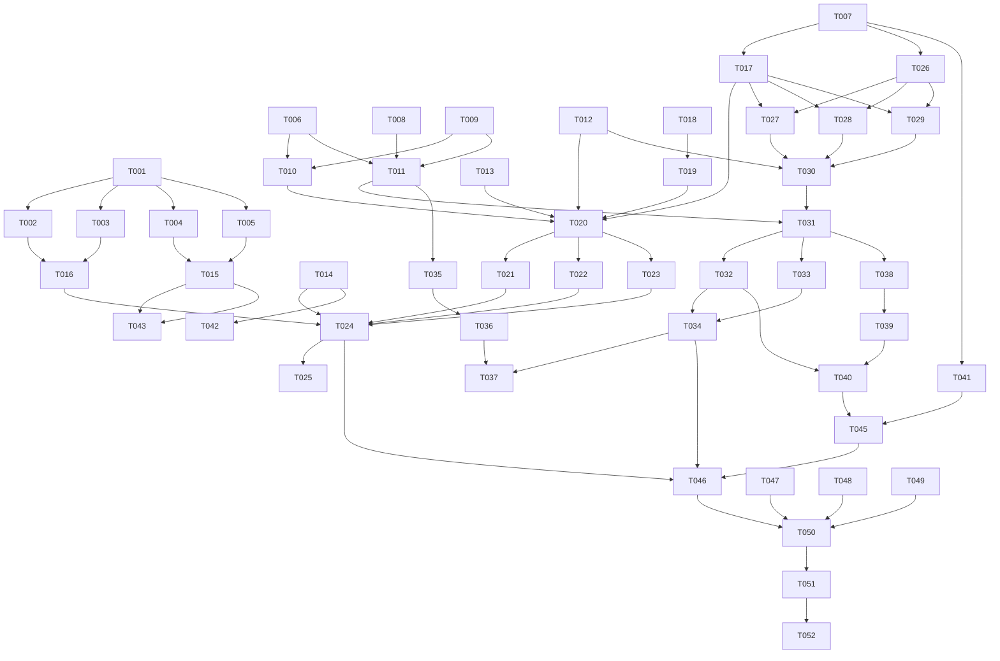

# Tasks: 沉浸光感多模型 AI 应用

**Input**: Design documents from `C:\Users\LomoCat\DevEcoStudioProjects\ImmersiveAI\spec\build-immersive-ai\`  
**Prerequisites**: `spec.md` and `plan.md`  
**Verification scope**: build-only

## Format

Every implementation task uses `- [ ] [TaskID] [P?] [Story?] Description with exact file path`. `[P]` means parallelizable; user-story tasks include `[US1]` through `[US5]`; setup, foundational, polish, and verification tasks do not carry a story label.

## Path Conventions

All paths are absolute and resolve under `C:\Users\LomoCat\DevEcoStudioProjects\ImmersiveAI`. HarmonyOS source files are under `entry/src/main/ets/`; resources are under `entry/src/main/resources/`.

## Phase 1: Setup（项目初始化）

- [X] T001 Create the HarmonyOS ArkTS project named ImmersiveAI at `C:\Users\LomoCat\DevEcoStudioProjects\ImmersiveAI\build-profile.json5`
- [X] T002 [P] Configure the entry module, Stage ability, permissions, and launch page manifest at `C:\Users\LomoCat\DevEcoStudioProjects\ImmersiveAI\entry\src\main\module.json5`
- [X] T003 [P] Configure launch page and keep it consistent with EntryAbility at `C:\Users\LomoCat\DevEcoStudioProjects\ImmersiveAI\entry\src\main\resources\base\profile\main_pages.json`
- [X] T004 [P] Create base and dark semantic color/string resources at `C:\Users\LomoCat\DevEcoStudioProjects\ImmersiveAI\entry\src\main\resources\base\element\color.json`
- [X] T005 [P] Create matching dark-theme semantic resources at `C:\Users\LomoCat\DevEcoStudioProjects\ImmersiveAI\entry\src\main\resources\dark\element\color.json`

---

## Phase 2: Foundational（阻塞性基础设施）

**Purpose**: Complete these tasks before implementing user stories.

- [X] T006 [P] Define provider, credential metadata, conversation, message, streaming, import preview, and protocol event models at `C:\Users\LomoCat\DevEcoStudioProjects\ImmersiveAI\entry\src\main\ets\model\ProviderModels.ets`
- [X] T007 [P] Define protocol-neutral chat messages, stream deltas, usage, errors, and state transitions at `C:\Users\LomoCat\DevEcoStudioProjects\ImmersiveAI\entry\src\main\ets\model\ProtocolModels.ets`
- [X] T008 [P] Define conversation and message persistence models at `C:\Users\LomoCat\DevEcoStudioProjects\ImmersiveAI\entry\src\main\ets\model\ChatModels.ets`
- [X] T009 Create database initialization, schema versioning, transaction, and resource-release boundary at `C:\Users\LomoCat\DevEcoStudioProjects\ImmersiveAI\entry\src\main\ets\data\DatabaseManager.ets`
- [X] T010 Create provider metadata repository without storing Key plaintext at `C:\Users\LomoCat\DevEcoStudioProjects\ImmersiveAI\entry\src\main\ets\data\ProviderRepository.ets`
- [X] T011 Create conversation/message repository with ordered queries and transactional mutations at `C:\Users\LomoCat\DevEcoStudioProjects\ImmersiveAI\entry\src\main\ets\data\ChatRepository.ets`
- [X] T012 Create Asset Store credential boundary for add, query, update, and delete operations at `C:\Users\LomoCat\DevEcoStudioProjects\ImmersiveAI\entry\src\main\ets\data\AssetCredentialStore.ets`
- [X] T013 [P] Define sanitized user-facing error categories and logging redaction rules at `C:\Users\LomoCat\DevEcoStudioProjects\ImmersiveAI\entry\src\main\ets\common\ErrorCatalog.ets`
- [X] T014 [P] Define semantic theme tokens, responsive layout constants, and copy/status labels at `C:\Users\LomoCat\DevEcoStudioProjects\ImmersiveAI\entry\src\main\ets\common\AppConstants.ets`
- [X] T015 [P] Add official material capability detection and explicit fallback state boundary at `C:\Users\LomoCat\DevEcoStudioProjects\ImmersiveAI\entry\src\main\ets\common\CapabilityDetector.ets`
- [X] T016 Configure ability startup, window behavior, system bars, and launch-page loading at `C:\Users\LomoCat\DevEcoStudioProjects\ImmersiveAI\entry\src\main\ets\entryability\EntryAbility.ets`

**Checkpoint**: Project builds structurally, storage boundaries exist, and all user-story work can use protocol-neutral models and repositories.

---

## Phase 3: User Story 1 - 配置模型供应商（Priority: P1）🎯 MVP

**Goal**: Create, import, validate, protect, edit, enable, disable, and delete six supplier configuration types.

**Independent Test**: Starting with no configuration, manually create one configuration and import one JSON configuration; verify masked Key handling, validation errors, edit/disable/delete behavior, and no plaintext persistence.

- [X] T017 [P] [US1] Implement provider-kind to protocol-style registry for OpenAI, OpenAI-compatible, DeepSeek, GLM, Anthropic, and Gemini at `C:\Users\LomoCat\DevEcoStudioProjects\ImmersiveAI\entry\src\main\ets\service\ProviderRegistry.ets`
- [X] T018 [P] [US1] Implement user-entered endpoint validation and non-semantic path normalization without default domains at `C:\Users\LomoCat\DevEcoStudioProjects\ImmersiveAI\entry\src\main\ets\service\EndpointNormalizer.ets`
- [X] T019 [P] [US1] Implement DocumentViewPicker JSON selection, decoding, schema validation, duplicate handling, and masked import preview at `C:\Users\LomoCat\DevEcoStudioProjects\ImmersiveAI\entry\src\main\ets\service\ImportService.ets`
- [X] T020 [US1] Implement provider configuration state, form validation, Asset Store coordination, and sanitized operation errors at `C:\Users\LomoCat\DevEcoStudioProjects\ImmersiveAI\entry\src\main\ets\viewmodel\ProviderViewModel.ets`
- [X] T021 [US1] Build provider summary cards with masked credentials, validation state, enable/disable, edit, and delete actions at `C:\Users\LomoCat\DevEcoStudioProjects\ImmersiveAI\entry\src\main\ets\components\ProviderCard.ets`
- [X] T022 [US1] Build manual provider editor with protocol-dependent fields and endpoint preview at `C:\Users\LomoCat\DevEcoStudioProjects\ImmersiveAI\entry\src\main\ets\components\ProviderEditor.ets`
- [X] T023 [US1] Build JSON import preview with validation errors, masked Key summary, confirmation, and cancellation at `C:\Users\LomoCat\DevEcoStudioProjects\ImmersiveAI\entry\src\main\ets\components\ImportPreview.ets`
- [X] T024 [US1] Assemble provider settings page and connect provider view model actions at `C:\Users\LomoCat\DevEcoStudioProjects\ImmersiveAI\entry\src\main\ets\views\ProviderSettingsView.ets`
- [X] T025 [US1] Integrate provider settings navigation into the main shell and first-use third-party data notice at `C:\Users\LomoCat\DevEcoStudioProjects\ImmersiveAI\entry\src\main\ets\views\MainShellView.ets`

**Checkpoint**: A user can independently configure at least one valid provider and manage it without exposing credentials.

---

## Phase 4: User Story 2 - 进行流式 AI 对话（Priority: P1）🎯 MVP

**Goal**: Send protocol-specific text requests, render incremental output, stop, retry, copy, and classify failures.

**Independent Test**: With one valid user configuration, create a conversation, send text, observe incremental output, stop generation, retry the last answer, copy answer text, and verify errors do not reveal the Key.

- [X] T026 [P] [US2] Implement byte decoding, SSE event boundaries, empty events, end markers, and incomplete-frame buffering at `C:\Users\LomoCat\DevEcoStudioProjects\ImmersiveAI\entry\src\main\ets\service\SseStreamParser.ets`
- [X] T027 [P] [US2] Implement OpenAI-style request mapping and response delta parsing for content, reasoning, finish reason, usage, and explicit errors at `C:\Users\LomoCat\DevEcoStudioProjects\ImmersiveAI\entry\src\main\ets\service\OpenAIStyleAdapter.ets`
- [X] T028 [P] [US2] Implement Claude-style message mapping and stream event parsing for message start, text deltas, message delta/end, usage, and explicit errors at `C:\Users\LomoCat\DevEcoStudioProjects\ImmersiveAI\entry\src\main\ets\service\ClaudeStyleAdapter.ets`
- [X] T029 [P] [US2] Implement Gemini-style contents mapping and candidate/parts stream parsing for text, finish reason, usage metadata, and explicit errors at `C:\Users\LomoCat\DevEcoStudioProjects\ImmersiveAI\entry\src\main\ets\service\GeminiStyleAdapter.ets`
- [X] T030 [US2] Implement official Network Kit requestInStream lifecycle, credential retrieval, cancellation, timeout, and protocol adapter dispatch at `C:\Users\LomoCat\DevEcoStudioProjects\ImmersiveAI\entry\src\main\ets\service\StreamingChatService.ets`
- [X] T031 [US2] Implement chat state, incremental message persistence, stop, retry, provider switching guard, and sanitized errors at `C:\Users\LomoCat\DevEcoStudioProjects\ImmersiveAI\entry\src\main\ets\viewmodel\ChatViewModel.ets`
- [X] T032 [US2] Build message cards with user/assistant states, completion status, error recovery, and local copy action at `C:\Users\LomoCat\DevEcoStudioProjects\ImmersiveAI\entry\src\main\ets\components\ChatMessageCard.ets`
- [X] T033 [US2] Build composer with provider/model selection, send, stop, retry, and empty-input validation at `C:\Users\LomoCat\DevEcoStudioProjects\ImmersiveAI\entry\src\main\ets\components\ChatComposer.ets`
- [X] T034 [US2] Assemble chat view with ordered scrolling messages and lifecycle-safe streaming updates at `C:\Users\LomoCat\DevEcoStudioProjects\ImmersiveAI\entry\src\main\ets\views\ChatView.ets`

**Checkpoint**: A configured provider can independently support a complete text conversation lifecycle without fabricated content.

---

## Phase 5: User Story 3 - 管理本地会话历史（Priority: P2）

**Goal**: Persist, restore, select, rename, and delete local conversations.

**Independent Test**: Create a multi-turn conversation, relaunch the application, reopen it, continue it, rename it, and delete it while confirming other conversations remain intact.

- [X] T035 [US3] Implement history loading, selection, title update, deletion confirmation, and empty/error states at `C:\Users\LomoCat\DevEcoStudioProjects\ImmersiveAI\entry\src\main\ets\viewmodel\HistoryViewModel.ets`
- [X] T036 [US3] Build history list, empty state, rename action, delete action, and selected conversation presentation at `C:\Users\LomoCat\DevEcoStudioProjects\ImmersiveAI\entry\src\main\ets\views\HistoryView.ets`
- [X] T037 [US3] Integrate history selection and new-conversation actions with the main shell and chat view at `C:\Users\LomoCat\DevEcoStudioProjects\ImmersiveAI\entry\src\main\ets\views\MainShellView.ets`

**Checkpoint**: Local conversation history remains independently usable after relaunch and does not corrupt unrelated conversations.

---

## Phase 6: User Story 4 - 阅读格式化回答（Priority: P2）

**Goal**: Render approved Markdown blocks safely during and after streaming, with readable long text and code blocks.

**Independent Test**: Feed headings, paragraphs, lists, quotes, code blocks, long lines, incomplete markers, and unsupported markers; verify readable safe output and no layout failure.

- [X] T038 [P] [US4] Implement controlled Markdown block parsing with incremental/incomplete input handling and safe plain-text fallback at `C:\Users\LomoCat\DevEcoStudioProjects\ImmersiveAI\entry\src\main\ets\service\MarkdownParser.ets`
- [X] T039 [P] [US4] Build themed Markdown block rendering for headings, paragraphs, lists, quotes, and code blocks at `C:\Users\LomoCat\DevEcoStudio\ImmersiveAI\entry\src\main\ets\components\MarkdownBlockView.ets`
- [X] T040 [US4] Integrate Markdown parsing and rendering into assistant message cards without executing external content at `C:\Users\LomoCat\DevEcoStudioProjects\ImmersiveAI\entry\src\main\ets\components\ChatMessageCard.ets`

**Checkpoint**: Formatted answers remain readable and safe independently of the selected provider.

---

## Phase 7: User Story 5 - 官方沉浸光感与主题适配（Priority: P2）

**Goal**: Provide official HDS navigation/tab material when supported, explicit fallback otherwise, and readable phone/tablet dark/light layouts.

**Independent Test**: Run on a supported and unsupported environment, switch navigation tabs, change system theme, and exercise chat/history/provider settings without losing accessibility or function.

- [X] T041 [P] [US5] Build collapsible reasoning section that appears only for parsed service-provided reasoning content at `C:\Users\LomoCat\DevEcoStudioProjects\ImmersiveAI\entry\src\main\ets\components\ReasoningSection.ets`
- [X] T042 [P] [US5] Define base/dark semantic theme tokens and responsive layout values consumed by views and components at `C:\Users\LomoCat\DevEcoStudioProjects\ImmersiveAI\entry\src\main\ets\common\ThemeTokens.ets`
- [X] T043 [US5] Assemble official HDS navigation and bottom tabs, apply verified system material effect only when capability detection succeeds, and provide explicit fallback at `C:\Users\LomoCat\DevEcoStudioProjects\ImmersiveAI\entry\src\main\ets\views\MainShellView.ets`
- [X] T044 [US5] Apply system theme resources, phone/tablet responsive layout, safe areas, and readable status styling across the launch page at `C:\Users\LomoCat\DevEcoStudioProjects\ImmersiveAI\entry\src\main\ets\pages\Index.ets`
- [X] T045 [US5] Connect reasoning content to assistant message rendering without generating missing reasoning text at `C:\Users\LomoCat\DevEcoStudioProjects\ImmersiveAI\entry\src\main\ets\components\ChatMessageCard.ets`

**Checkpoint**: Core screens remain usable and readable with verified official material or an explicit fallback.

---

## Phase 8: Polish and Cross-Cutting Concerns

- [X] T046 [P] Audit all source and resource files for hardcoded Keys, endpoints, fabricated model states, and unredacted diagnostics at `C:\Users\LomoCat\DevEcoStudioProjects\ImmersiveAI\entry\src\main\ets\`
- [X] T047 [P] Audit HiveChat reference usage to ensure only independently implemented protocol behavior remains and no source file was copied at `C:\Users\LomoCat\DevEcoStudioProjects\ImmersiveAI\entry\src\main\ets\service\`
- [X] T048 [P] Complete accessibility labels, readable contrast, touch targets, empty states, and error recovery text at `C:\Users\LomoCat\DevEcoStudioProjects\ImmersiveAI\entry\src\main\resources\base\element\string.json`
- [X] T049 [P] Verify matching base/dark semantic resource keys and remove unsupported UI material claims at `C:\Users\LomoCat\DevEcoStudioProjects\ImmersiveAI\entry\src\main\resources\dark\element\color.json`
- [X] T050 Run ArkTS strict static checks and resolve source-level diagnostics without changing approved requirements at `C:\Users\LomoCat\DevEcoStudioProjects\ImmersiveAI\entry\src\main\ets\` — source diagnostics clear; remaining diagnostics originate in installed SDK declarations.

---

## Phase 9: Verification

<!-- verification_scope: build-only -->

- [ ] T051 Build the project and fix compilation errors through the implementation agent's verification loop at `C:\Users\LomoCat\DevEcoStudioProjects\ImmersiveAI\build-profile.json5` — deferred to verification phase.
- [ ] T052 Deploy the application to the selected device or emulator and confirm it is installable at `C:\Users\LomoCat\DevEcoStudioProjects\ImmersiveAI\entry\src\main\ets\entryability\EntryAbility.ets` — deferred to verification phase.

---

## Dependencies & Execution Order

### Phase Dependencies

- Setup T001-T005 has no prerequisite other than the selected project location.
- Foundational T006-T016 depends on project setup and blocks all user stories.
- US1 and US2 both depend on foundational models, storage, and common boundaries.
- US3 depends on the chat repository and integrates with the shell after US2's chat surface exists.
- US4 depends on assistant message rendering and can be implemented after the streaming model exists.
- US5 depends on the shell, capability detector, resources, and message rendering.
- Polish T046-T050 follows the desired user stories; verification T051-T052 follows polish.

### User Story Dependencies

- US1: no user-story dependency after foundational completion.
- US2: uses provider metadata and credential boundaries from US1, but its protocol adapters remain independently testable with supplied configuration.
- US3: uses conversation/message repository and integrates with the chat surface.
- US4: uses assistant message presentation from US2.
- US5: uses the shell and message surface from US1/US2, while material detection remains independently testable.

## Parallel Example

After foundational completion, the following non-conflicting work may run in parallel: T017-T018; T027-T029; T038-T039; T041-T042; T046-T049. Integration tasks must wait for their listed predecessors.

## 📊 Dependency Graph

## ⚡ Parallel Execution Guide

| Phase | Tasks | Required Files | Execution Notes |
|---|---|---|---|
| Setup | T002-T005 | module, launch manifest, base/dark resources | Run after T001; T002-T005 can proceed in parallel. |
| Foundational models | T006-T008, T013-T015 | model and common files | Can proceed in parallel after project setup. |
| Foundational storage | T009-T012 | data files | T009 precedes repositories; T010 and T011 can then proceed in parallel; T012 is independent. |
| US1 services | T017-T019 | registry, endpoint, import services | T017 and T018 can proceed in parallel; T019 depends on T018. |
| US1 UI | T021-T024 | provider components, view, viewmodel | T021-T023 can proceed after T020; T024 depends on them. |
| US2 adapters | T026-T029 | SSE parser and three adapters | T027-T029 can proceed in parallel after models and T026. |
| US2 integration | T030-T034 | chat service, viewmodel, chat components | Must proceed in dependency order. |
| US3 | T035-T037 | history viewmodel, history view, shell | T035 and T036 can begin after repository; T037 integrates both. |
| US4 | T038-T040 | Markdown service/component/message card | T038 and T039 can proceed in parallel; T040 integrates them. |
| US5 | T041-T045 | reasoning, theme, shell, index, message card | T041/T042 can proceed in parallel; T043-T045 integrate visual behavior. |
| Polish | T046-T050 | source and resources | T046-T049 can proceed in parallel; T050 follows all audits. |
| Verification | T051-T052 | project and ability | T052 depends on successful T051. |

## Implementation Strategy

### MVP First

1. Complete T001-T016.
2. Complete T017-T025 for provider configuration.
3. Complete T026-T034 for streaming conversation.
4. Validate US1 and US2 independently before adding P2 stories.

### Incremental Delivery

1. Setup and foundational infrastructure.
2. US1 provider configuration as the first usable slice.
3. US2 streaming chat as the core MVP.
4. US3 local history.
5. US4 Markdown presentation.
6. US5 official material, fallback, theme, and responsive polish.
7. Cross-cutting audits, static checks, build, and deployment.

## Notes

- Tests are not separate tasks because the approved specification requested verification but did not require a TDD workflow; each user-story phase includes an independent test criterion.
- `[P]` tasks must not modify the same file concurrently.
- The implementation agent must not add requirements, default endpoints, fabricated content, or copied HiveChat source.
- The verification phase is build-only; no UI verification task is included.

## Summary Report

- **Total tasks**: 52
- **Setup tasks**: 5
- **Foundational tasks**: 11
- **US1 tasks**: 9
- **US2 tasks**: 9
- **US3 tasks**: 3
- **US4 tasks**: 3
- **US5 tasks**: 5
- **Polish tasks**: 5
- **Verification tasks**: 2
- **Parallel opportunities**: setup resources; foundational models/common/storage; US1 service preparation; three US2 protocol adapters; US4 parser and renderer; polish audits.
- **Independent user-story criteria**: documented in every user-story phase.
- **Verification scope**: build-only, encoded by `<!-- verification_scope: build-only -->`.
