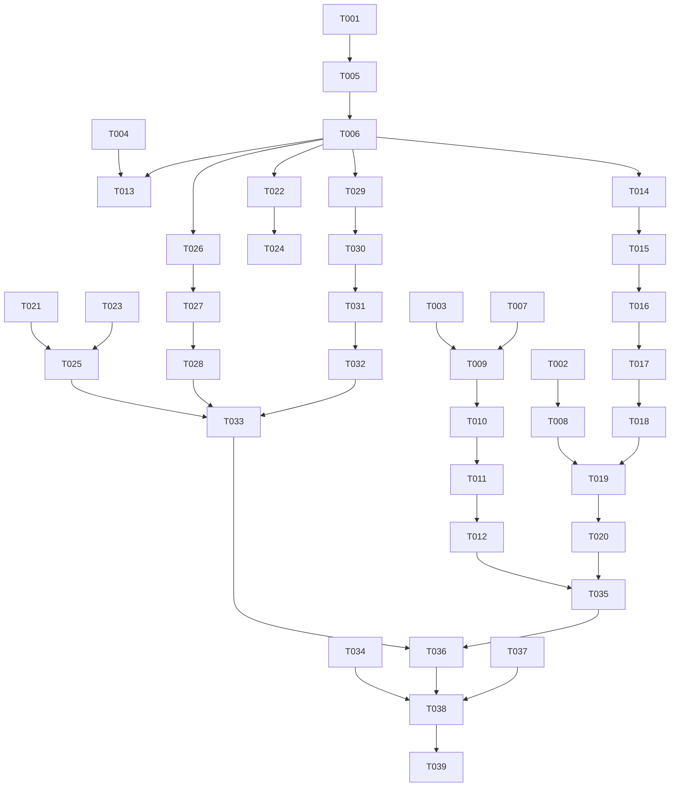

# Tasks: ImmersiveAI 底部沉浸布局、我的入口与核心流程修复

**Input**: `spec/rebuild-immersive-ai/spec.md`、`spec/rebuild-immersive-ai/plan.md`
**Prerequisites**: `spec.md`、`plan.md`
**Target**: ArkTS 严格模式、API 24、HUAWEI Mate 70 Pro

## Format

每项任务使用 `- [ ] [TaskID] [P?] [Story?] 描述及准确文件路径` 格式。用户故事任务必须带 `[USx]` 标签；Setup、Foundational、Polish 和 Verification 任务不带故事标签。

## Path Conventions

- 工程根目录：`C:\Users\LomoCat\DevEcoStudioProjects\ImmersiveAI`
- ArkTS 源码：`entry/src/main/ets/`
- 资源：`entry/src/main/resources/`
- 规格目录：`spec/rebuild-immersive-ai/`
- 参考工程：`C:\Files\Codes\HarmonyApps\fork\ClashBox-master`
- 不修改数据库 schema、协议适配、流式聊天、Asset Store Kit、端点来源或凭据存储边界。

## Phase 1: Setup (Shared Infrastructure)

**目的**：审计当前根布局、HDS Tabs、安全区、导航和参考工程边界。

- [X] T001 审计 Index、MainShellView、MainNavigation 的根高度、底部 padding、内容 inset、bar margin 和背景链路于 `C:\Users\LomoCat\DevEcoStudioProjects\ImmersiveAI\entry\src\main\ets\pages\Index.ets`、`C:\Users\LomoCat\DevEcoStudioProjects\ImmersiveAI\entry\src\main\ets\views\MainShellView.ets` 和 `C:\Users\LomoCat\DevEcoStudioProjects\ImmersiveAI\entry\src\main\ets\components\MainNavigation.ets`
- [X] T002 [P] 核对当前 SDK 的 HdsTabs 底部安全区、HdsNavigation、hdsMaterial 和系统材质声明于 `C:\Users\LomoCat\DevEcoStudioProjects\ImmersiveAI\entry\src\main\ets\common\CapabilityDetector.ets`
- [X] T003 [P] 参考 ClashBox 的全屏根容器、Tabs 内容/底部栏分离和 More/Appearance 设置行模式，记录适用边界于 `C:\Files\Codes\HarmonyApps\fork\ClashBox-master\entry\src\main\ets\pages\Index.ets` 和 `C:\Files\Codes\HarmonyApps\fork\ClashBox-master\entry\src\main\ets\pages\MorePage.ets`
- [X] T004 [P] 审计默认和深色资源中的导航、我的、材质和反馈文案键于 `C:\Users\LomoCat\DevEcoStudioProjects\ImmersiveAI\entry\src\main\resources\base\element\string.json` 和 `C:\Users\LomoCat\DevEcoStudioProjects\ImmersiveAI\entry\src\main\resources\dark\element\string.json`

---

## Phase 2: Foundational (Blocking Prerequisites)

**目的**：建立四页导航、页内设置状态、唯一安全区边界和共享材质状态。

- [ ] T005 扩展 ShellTab、导航来源和页内设置状态模型以支持“我的”及返回状态于 `C:\Users\LomoCat\DevEcoStudioProjects\ImmersiveAI\entry\src\main\ets\model\ShellModels.ets`
- [ ] T006 统一 AppShellViewModel 的四页签选中态、我的设置页状态、导航意图和材质刷新状态于 `C:\Users\LomoCat\DevEcoStudioProjects\ImmersiveAI\entry\src\main\ets\viewmodel\AppShellViewModel.ets`
- [ ] T007 [P] 整理唯一根窗口背景、系统底部安全区、导航视觉 inset、内容底部 inset 和键盘避让令牌于 `C:\Users\LomoCat\DevEcoStudioProjects\ImmersiveAI\entry\src\main\ets\common\ThemeTokens.ets`
- [ ] T008 [P] 保持四档材质能力检测、持久化读取/写入和真实降级原因边界于 `C:\Users\LomoCat\DevEcoStudioProjects\ImmersiveAI\entry\src\main\ets\common\CapabilityDetector.ets` 和 `C:\Users\LomoCat\DevEcoStudioProjects\ImmersiveAI\entry\src\main\ets\common\AppStore.ets`

**检查点**：四页签、页内设置状态、材质状态和唯一安全区职责可供用户故事使用。

---

## Phase 3: User Story 1 - 全屏底部布局与安全区导航 (Priority: P1)

**目标**：消除底部大白框和内容整体上移，保持页面铺满窗口，导航位于安全区内且不遮挡内容。

**独立验收**：四个页签均无独立白框，内容可滚动到底部，导航不被裁剪、不进入系统指示器区域。

- [ ] T009 [US1] 移除根级重复底部挤压，保持页面根容器和主壳完整占满窗口，并统一底部背景于 `C:\Users\LomoCat\DevEcoStudioProjects\ImmersiveAI\entry\src\main\ets\pages\Index.ets`
- [ ] T010 [US1] 重构 HDS Tabs 与 fallback 的高度、底部安全区背景和导航视觉位置，避免 bar margin 与安全区重复叠加于 `C:\Users\LomoCat\DevEcoStudioProjects\ImmersiveAI\entry\src\main\ets\views\MainShellView.ets`
- [ ] T011 [US1] 将内容底部 inset 从导航位置中分离，并应用到 Chat、History、Provider 和 My 内容容器于 `C:\Users\LomoCat\DevEcoStudioProjects\ImmersiveAI\entry\src\main\ets\common\ThemeTokens.ets`、`C:\Users\LomoCat\DevEcoStudioProjects\ImmersiveAI\entry\src\main\ets\views\ChatView.ets`、`C:\Users\LomoCat\DevEcoStudioProjects\ImmersiveAI\entry\src\main\ets\views\HistoryView.ets` 和 `C:\Users\LomoCat\DevEcoStudioProjects\ImmersiveAI\entry\src\main\ets\views\ProviderSettingsView.ets`
- [ ] T012 [US1] 确保导航栏、页面背景和安全区视觉连续，并审计最后一项、输入区和按钮可达性于 `C:\Users\LomoCat\DevEcoStudioProjects\ImmersiveAI\entry\src\main\ets\views\MainShellView.ets` 和 `C:\Users\LomoCat\DevEcoStudioProjects\ImmersiveAI\entry\src\main\ets\pages\Index.ets`

**检查点**：根布局不再制造白框，四页内容和底部导航各自承担正确的安全区职责。

---

## Phase 4: User Story 2 - “我的”页签中的沉浸光感设置 (Priority: P1)

**目标**：新增“我的”页签，在其页面内进入材质设置页，选择四档材质并即时持久化应用。

**独立验收**：点击“我的”后点击“沉浸光感材质”最多两步进入页内设置；四档选项可见，返回和重启恢复有效。

- [ ] T013 [P] [US2] 在底部导航增加“我的”入口、选中态和统一 NavigationIntent 回调于 `C:\Users\LomoCat\DevEcoStudioProjects\ImmersiveAI\entry\src\main\ets\components\MainNavigation.ets`
- [ ] T014 [US2] 在 ShellTab 内容中装配“我的”页面，并保持聊天、历史、供应商入口不变于 `C:\Users\LomoCat\DevEcoStudioProjects\ImmersiveAI\entry\src\main\ets\views\MainShellView.ets`
- [ ] T015 [US2] 创建“我的”列表页和“沉浸光感材质”入口摘要，采用列表行模式于 `C:\Users\LomoCat\DevEcoStudioProjects\ImmersiveAI\entry\src\main\ets\views\MyView.ets` 和 `C:\Users\LomoCat\DevEcoStudioProjects\ImmersiveAI\entry\src\main\ets\components\MySettingsEntry.ets`
- [ ] T016 [US2] 创建“我的”页内材质设置页，提供明确返回“我的”列表和四档设置装配于 `C:\Users\LomoCat\DevEcoStudioProjects\ImmersiveAI\entry\src\main\ets\views\MaterialSettingsView.ets`
- [ ] T017 [US2] 将 MaterialSettings 接入“我的”页内设置页，展示固定中文标签、选中态、默认态和真实能力说明于 `C:\Users\LomoCat\DevEcoStudioProjects\ImmersiveAI\entry\src\main\ets\components\MaterialSettings.ets`
- [ ] T018 [US2] 移除 ProviderSettingsView 中的材质设置入口，并保持供应商页面只负责供应商业务于 `C:\Users\LomoCat\DevEcoStudioProjects\ImmersiveAI\entry\src\main\ets\views\ProviderSettingsView.ets`
- [ ] T019 [US2] 将材质选择、持久化恢复、即时 HDS 刷新和返回状态接入共享 ViewModel 于 `C:\Users\LomoCat\DevEcoStudioProjects\ImmersiveAI\entry\src\main\ets\viewmodel\AppShellViewModel.ets`
- [ ] T020 [US2] 将有效材质等级应用于 HDS 顶部标题栏和底部导航，保留系统动态材质及滚动绑定于 `C:\Users\LomoCat\DevEcoStudioProjects\ImmersiveAI\entry\src\main\ets\views\MainShellView.ets`

**检查点**：材质入口只在“我的”中出现，页内进入/返回不改变导航选中态，四档选择立即生效并持久化。

---

## Phase 5: User Story 3 - 供应商核心流程可用 (Priority: P1)

**目标**：修复密钥输入黑屏、显式取消和目标供应商连接重试等供应商闭环。

**独立验收**：完成供应商编辑、密钥输入/取消、保存、测试、重试、启停、删除和导入操作，并获得中文反馈。

- [ ] T021 [P] [US3] 修复密钥输入聚焦、键盘避让、遮罩和显式取消编辑后的页面可见性于 `C:\Users\LomoCat\DevEcoStudioProjects\ImmersiveAI\entry\src\main\ets\components\ProviderEditor.ets`
- [ ] T022 [US3] 接通供应商表单取消、保存、测试和中文操作状态于 `C:\Users\LomoCat\DevEcoStudioProjects\ImmersiveAI\entry\src\main\ets\views\ProviderSettingsView.ets` 和 `C:\Users\LomoCat\DevEcoStudioProjects\ImmersiveAI\entry\src\main\ets\viewmodel\ProviderViewModel.ets`
- [ ] T023 [P] [US3] 修复供应商卡片编辑、启停、测试、删除命中区和回调反馈于 `C:\Users\LomoCat\DevEcoStudioProjects\ImmersiveAI\entry\src\main\ets\components\ProviderCard.ets`
- [ ] T024 [US3] 将连接测试重试绑定到明确供应商，并保持 Key 不出现在反馈和日志于 `C:\Users\LomoCat\DevEcoStudioProjects\ImmersiveAI\entry\src\main\ets\components\ConnectionTestResult.ets` 和 `C:\Users\LomoCat\DevEcoStudioProjects\ImmersiveAI\entry\src\main\ets\viewmodel\ProviderViewModel.ets`
- [ ] T025 [US3] 校验导入确认/取消、清空、删除和失败刷新边界于 `C:\Users\LomoCat\DevEcoStudioProjects\ImmersiveAI\entry\src\main\ets\viewmodel\ProviderViewModel.ets`

**检查点**：供应商所有核心操作形成控件、命中区、回调、ViewModel、刷新和中文反馈闭环。

---

## Phase 6: User Story 4 - Chat 与 History 跨页核心流程可用 (Priority: P1)

**目标**：修复 Chat 返回选中态及核心操作，并修复 History 新建、打开、重命名和删除闭环。

**独立验收**：Chat 配置引导/返回和按钮矩阵可用；History 操作只影响目标会话且即时反馈。

- [ ] T026 [US4] 修复聊天配置引导、明确返回聊天和底部聊天选中态同步于 `C:\Users\LomoCat\DevEcoStudioProjects\ImmersiveAI\entry\src\main\ets\views\ChatView.ets` 和 `C:\Users\LomoCat\DevEcoStudioProjects\ImmersiveAI\entry\src\main\ets\viewmodel\AppShellViewModel.ets`
- [ ] T027 [P] [US4] 修复供应商/模型选择、发送、停止、重试、复制命中区和中文反馈于 `C:\Users\LomoCat\DevEcoStudioProjects\ImmersiveAI\entry\src\main\ets\views\ChatView.ets`
- [ ] T028 [US4] 修复消息卡片重试/复制回调、不可用提示、消息去重和安全文本展示于 `C:\Users\LomoCat\DevEcoStudioProjects\ImmersiveAI\entry\src\main\ets\components\ChatMessageCard.ets` 和 `C:\Users\LomoCat\DevEcoStudioProjects\ImmersiveAI\entry\src\main\ets\viewmodel\ChatViewModel.ets`
- [ ] T029 [P] [US4] 修复历史页新建、打开、重命名、删除入口和即时中文反馈于 `C:\Users\LomoCat\DevEcoStudioProjects\ImmersiveAI\entry\src\main\ets\views\HistoryView.ets`
- [ ] T030 [US4] 修复历史条目编辑、保存、取消、打开、删除和目标标识传递于 `C:\Users\LomoCat\DevEcoStudioProjects\ImmersiveAI\entry\src\main\ets\components\HistoryItem.ets`
- [ ] T031 [US4] 修复历史 ViewModel 的新建反馈、打开同步、重命名保存/取消和删除刷新于 `C:\Users\LomoCat\DevEcoStudioProjects\ImmersiveAI\entry\src\main\ets\viewmodel\HistoryViewModel.ets`
- [ ] T032 [US4] 校验会话创建、标题更新、有序读取和目标删除边界于 `C:\Users\LomoCat\DevEcoStudioProjects\ImmersiveAI\entry\src\main\ets\data\ChatRepository.ets`

**检查点**：Chat 和 History 的独立操作均具备可见反馈、正确目标和持久化结果。

---

## Phase 7: Polish & Cross-Cutting Concerns

- [ ] T033 [P] 完成导航、“我的”、材质、布局和业务反馈的全工程简体中文及深色资源一致性审计于 `C:\Users\LomoCat\DevEcoStudioProjects\ImmersiveAI\entry\src\main\resources\base\element\string.json` 和 `C:\Users\LomoCat\DevEcoStudioProjects\ImmersiveAI\entry\src\main\resources\dark\element\string.json`
- [ ] T034 [P] 审计 Key 遮罩、日志/错误反馈不泄露凭据和现有受保护存储边界于 `C:\Users\LomoCat\DevEcoStudioProjects\ImmersiveAI\entry\src\main\ets\data\AssetCredentialStore.ets`、`C:\Users\LomoCat\DevEcoStudioProjects\ImmersiveAI\entry\src\main\ets\components\ProviderEditor.ets` 和 `C:\Users\LomoCat\DevEcoStudioProjects\ImmersiveAI\entry\src\main\ets\components\ConnectionTestResult.ets`
- [ ] T035 [P] 审计 HDS API、普通 fallback、白色占位背景、自制光效和根级重复安全区配置于 `C:\Users\LomoCat\DevEcoStudioProjects\ImmersiveAI\entry\src\main\ets\views\MainShellView.ets`、`C:\Users\LomoCat\DevEcoStudioProjects\ImmersiveAI\entry\src\main\ets\pages\Index.ets` 和 `C:\Users\LomoCat\DevEcoStudioProjects\ImmersiveAI\entry\src\main\ets\common\CapabilityDetector.ets`
- [ ] T036 运行 ArkTS 严格模式静态检查并处理应用源文件诊断于 `C:\Users\LomoCat\DevEcoStudioProjects\ImmersiveAI\entry\src\main\ets\`
- [ ] T037 [P] 校验 API 24、启动能力、资源和模块配置于 `C:\Users\LomoCat\DevEcoStudioProjects\ImmersiveAI\entry\src\main\module.json5`

---

## Phase 8: Verification

<!-- verification_scope: build-only -->

**目的**：验证代码可编译、可签名部署并可启动。本轮不包含 UI 验证任务。

- [X] T038 构建 ImmersiveAI 并修复编译、资源或签名问题，使用 `build_project` 验证 `entry@default` 产物于 `C:\Users\LomoCat\DevEcoStudioProjects\ImmersiveAI\entry\build\default\outputs\default\`
- [X] T039 将签名 HAP 部署并启动到可用设备，使用 `start_app` 验证安装和启动于 `C:\Users\LomoCat\DevEcoStudioProjects\ImmersiveAI\entry\build\default\outputs\default\entry-default-signed.hap`

---

## 📊 Dependency Graph



## ⚡ Parallel Execution Guide

| Phase | Tasks | Required Files | Execution Notes |
|---|---|---|---|
| Setup | T002, T003, T004 | SDK declarations、参考工程、资源 JSON | 可与 T001 的总体审计并行。 |
| Foundational | T007, T008 | `common/ThemeTokens.ets`、`common/CapabilityDetector.ets`、`common/AppStore.ets` | 文件边界不同；依赖审计结果。 |
| US1 | T009, T011 | `pages/Index.ets`、内容视图和主题令牌 | 根布局先确定，内容 inset 随后统一。 |
| US2 | T013, T015 | `components/MainNavigation.ets`、`views/MyView.ets` | 共享 ShellTab 完成后可并行设计入口与页面。 |
| US3 | T021, T023 | `ProviderEditor.ets`、`ProviderCard.ets` | 不修改同一文件，可并行。 |
| US4 | T027, T029 | `ChatView.ets`、`HistoryView.ets` | 不修改同一文件，可并行；依赖共享导航状态。 |
| Polish | T033, T034, T035, T037 | 资源、凭据、HDS、模块配置 | 按文件边界并行，依赖相关功能完成。 |

## Dependencies & Execution Order

### Phase Dependencies

- Setup 无前置依赖。
- Foundational 依赖 Setup，阻塞所有用户故事。
- US1 先完成根布局边界；US2 依赖共享导航和材质状态；US3/US4 可在基础状态完成后并行。
- Polish 依赖相关用户故事完成。
- Verification 依赖实现、审计和 ArkTS 检查完成。

### User Story Dependencies

- US1：依赖 Foundational，无其他故事依赖。
- US2：依赖 Foundational，并依赖 US1 的根布局边界。
- US3：依赖 Foundational，可与 US4 并行。
- US4：依赖 Foundational 和统一 ShellTab 状态，可与 US3 并行。

## Parallel Example: User Story 2

```text
T013：完成四项底部导航入口。
T015：完成“我的”列表页和材质入口行。
T016：完成页内材质设置页，并在共享状态契约完成后接入 T017。
```

## Implementation Strategy

### MVP First

1. 完成 T001–T008，确认根布局、安全区和共享状态边界。
2. 完成 T009–T012，先消除底部白框和内容挤压。
3. 完成 T013–T020，交付“我的”入口和页内四档材质设置。
4. 在继续业务修复前，独立验收 US1 和 US2。

### Incremental Delivery

1. 根布局修复后交付四页稳定导航。
2. “我的”页内设置完成后交付材质即时应用和重启恢复。
3. 交付 Provider、Chat、History 核心闭环。
4. 完成 HDS、中文、Key 和资源审计，再执行构建与部署。

## Notes

- **Total tasks**：39。
- **Per-story count**：US1 4 项；US2 8 项；US3 5 项；US4 7 项。
- **Other tasks**：Setup 4 项；Foundational 4 项；Polish 5 项；Verification 2 项。
- **Independent criteria**：每个用户故事均包含独立验收条件和检查点。
- **Suggested MVP**：T001–T020。
- **Verification scope**：`build-only`，由 Phase 3 验证范围选择确定；不生成 UI 验证任务。
- **Reference boundary**：仅参考 ClashBox 的布局和设置入口模式，不复制其业务代码或依赖。
